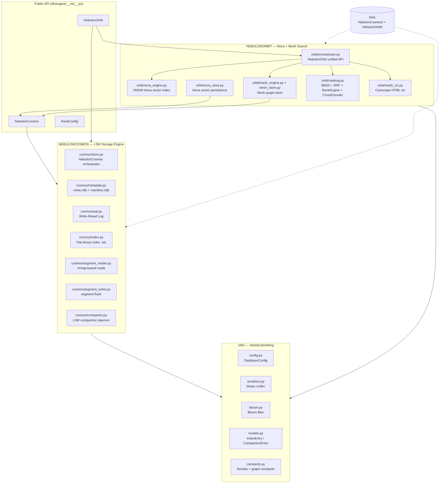
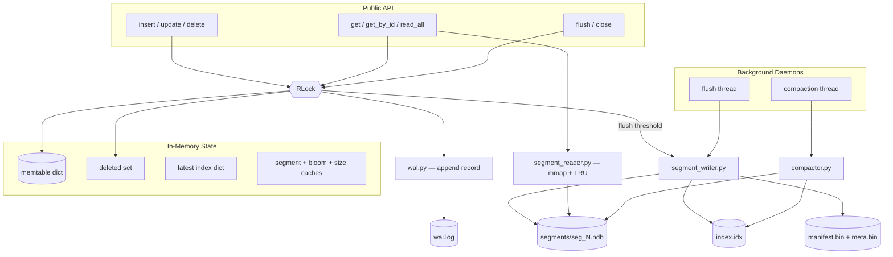

# NebulonDB Engine Overview

A modular database engine for **NebulonDB** that pairs two complementary storage
systems under one roof:

- **NebulonCosmos** — a durable, LSM-tree inspired key/value storage engine
  (the "write & persist" layer).
- **NebulonOrbit** — a **Nova + Mesh** search engine built **on top of Cosmos**
  (the "retrieve & rank" layer), where **Nova** is the vector subsystem and
  **Mesh** is the graph subsystem.

Both engines live in `db/engine`, share the `utils/` package, and expose a
single public surface from `db/engine/__init__.py`:

```python
from db.engine import NebulonCosmos, NebulonOrbit, RankConfig
```

### Nova & Mesh — the two search engines of NebulonOrbit

* **Nova** — the **vector** subsystem. An HNSW approximate-nearest-neighbor
  (ANN) index (`nova_engine.py`) built on `hnswlib`, with generational saves,
  SHA-256 checksums and manifest-based fallback recovery. Vectors are persisted
  as dedicated records in the `nebulon_nova` Cosmos segment (`nova_store.py`);
  their text/metadata live separately in `nebulon_documents`
  (`document_store.py`). A shared `id` links a document to its vector.
  **Nova answers "what is most similar to this?"**

* **Mesh** — the **graph** subsystem. An in-memory graph of nodes and directed,
  weighted, labeled edges (`mesh_engine.py` + `mesh_store.py`), persisted as
  normalized per-row records in the `nebulon_mesh_nodes` and
  `nebulon_mesh_edges` Cosmos segments and rendered as an interactive
  Cytoscape.js HTML visualization (`mesh_viz.py`). Edge `weight` is
  auto-computed as the cosine similarity of the two endpoint vectors (or `1.0`
  when either endpoint has no vector). **Mesh answers "what is connected to
  this?"**

Together they power the **hybrid** search mode: Nova retrieves the closest
vector hits, then Mesh expands around them (and an optional seed node) through
graph neighbors.

---

## 1. High-Level Architecture



### Component roles at a glance

| Layer | Component | Responsibility |
|---|---|---|
| Public | `NebulonCosmos` | Durable key/value CRUD (insert/update/delete/get/read_all) |
| Public | `NebulonOrbit` | Unified Nova (vector) + Mesh (graph) search with ranking, WAL + LSN recovery |
| Cosmos | `store.py` | Thin orchestrator that wires all Cosmos submodules together |
| Cosmos | `wal.py` | Append-only, CRC-checked write-ahead log + crash recovery |
| Cosmos | `index.py` | Flat binary index file (`record_id -> segment_id, offset, version`) |
| Cosmos | `segment_writer.py` | Memtable flush to immutable segments; streaming writes for compaction |
| Cosmos | `segment_reader.py` | mmap + LRU open-file cache record reads |
| Cosmos | `compactor.py` | Merge segments, drop deletes, background daemon thread |
| Cosmos | `metadata.py` | Atomic `meta.ndb` / `manifest.ndb` persistence |
| Orbit | `orchestrator.py` | Search modes, transactions, WAL replay, hybrid search |
| Orbit | `nova_engine.py` | Nova HNSW vector index (hnswlib) with generations + checksums |
| Orbit | `nova_store.py` | Nova vector records persisted inside the `nebulon_nova` Cosmos segment |
| Orbit | `document_store.py` | Document text + metadata persisted in the `nebulon_documents` Cosmos segment |
| Orbit | `mesh_engine.py`/`mesh_store.py` | In-memory Mesh graph, persisted as per-row nodes/edges (`nebulon_mesh_nodes` / `nebulon_mesh_edges`) |
| Orbit | `ranking.py` | BM25, RRF fusion, multi-signal RankEngine, cross-encoder rerank |
| Orbit | `mesh_viz.py` | Cytoscape.js HTML Mesh visualization |
| Utils | all | Config, binary codec, Bloom filter, dataclasses, constants |

---

## 2. NebulonCosmos — LSM-tree Storage Engine

### Architecture



### Write path

1. **Memtable + WAL** — every write (`insert`/`update`/`delete`) is serialized
   with `utils/serializer.encode_object`, appended to `wal.log` (length-prefixed
   + CRC32), then applied to the in-memory `memtable` (keyed by
   `(segment, record_id)`). Deletes are tombstones tracked in a `deleted` set.
   Record IDs are allocated from a **single global counter**
   (`meta["global_record_id"]`) rather than per table, so record IDs never
   collide across tables (e.g. `nebulon_userinfo` vs `nebulon_metadata`).
2. **Flush** — when the memtable crosses `FLUSH_RECORD_THRESHOLD`,
   `FLUSH_SIZE_THRESHOLD` (16 MB), the byte cap (256 MB), or the background
   flush thread's age/interval checks, `segment_writer.flush` writes an
   immutable segment file:
   - `[header | bloom-filter blob | records...]`
   - each record: `[CRC32 | compressed_len | orig_len | zlib payload]`
   - the WAL is truncated and `manifest.bin` / `meta.bin` are saved atomically.
3. **Index** — offsets are appended to the flat binary `index.idx`:
   `(record_id, segment_id, offset, version)` (`ENTRY_FORMAT "<QIQ Q"`).

### Read path

1. Check `deleted` set → memtable → `latest` index (highest version wins).
2. Bloom filter quick-reject before touching disk.
3. `segment_reader.read_payload_at_offset` reads via mmap with an LRU
   open-file cache (`MAX_OPEN_SEGMENTS`), decompresses, and CRC-verifies.

### Compaction

- Keeps segments bounded (`MAX_SEGMENTS_BEFORE_COMPACT`).
- Streams live (non-deleted, latest-version) records into one new segment
  without loading everything in memory, then removes old files, and **rebuilds
  the in-memory `latest` index from the remaining segment files** (never just
  re-persisting the pre-merge map), so no index entry can reference a removed
  segment after a merge.
- Merge selection is keyed by `(table, record_id)`, so records from different
  tables that happen to share a record id are never silently dropped during a
  merge.
- Runs both on-demand (`flush`/threshold) and from a daemon thread at
  `COMPACTION_INTERVAL`.

### Crash recovery

On startup Cosmos loads `meta.bin` + `manifest.bin`, builds the `latest` index
(with automatic rebuild if corrupt), then **replays `wal.log`** back into the
memtable, restoring segment counters, the global version counter, and the
global record-id counter before flushing.

### Key features

| Feature | Where |
|---|---|
| LSM-tree design (memtable → immutable segments → compaction) | `store.py`, `segment_writer.py`, `compactor.py` |
| Crash-safe WAL with CRC + fsync | `wal.py` |
| Atomic file writes (`os.replace` + fsync) | `metadata.py` |
| Binary index + full rebuild fallback | `index.py` |
| Bloom filters to skip I/O | `utils/bloom.py`, `segment_writer.py` |
| Optional per-segment zlib compression | `segment_writer.py` |
| mmap reads with LRU segment cache | `segment_reader.py` |
| Background flush + compaction daemons | `store.py` |
| Custom binary codec (varint + type tags) | `utils/serializer.py` |
| Multi-table ("segment") namespacing | `store.py` |
| Globally-unique record IDs across all tables (no cross-table collisions) | `store.py`, `wal.py` |
| Data-safe compaction (index rebuilt from segments; `(table, id)` merge keys) | `compactor.py`, `segment_writer.py` |

---

## 3. NebulonOrbit — Nova + Mesh Search Engine

### Architecture

```mermaid
flowchart TB
    subgraph OrbitAPI["NebulonOrbit (orchestrator.py)"]
        WALO[LSN WAL + replay]
        TX[transaction-safe insert/update/delete]
        SRCH[search modes]
        RANK2[ranked_search / rerank]
        G[Mesh traversal API]
    end

    subgraph NOVA["Nova Subsystem (vector)"]
        NE[nova_engine.py<br/>HNSW (hnswlib)]
        NS[nova_store.py<br/>persists vectors in Cosmos segment]
        MAN[manifest.py<br/>generation tracker]
    end

    subgraph MESH["Mesh Subsystem (graph)"]
        ME[mesh_engine.py<br/>BFS/DFS/shortest path]
        MS[mesh_store.py<br/>single-master-doc persistence]
        MV[mesh_viz.py<br/>Cytoscape HTML]
    end

    subgraph RANK["Ranking Subsystem"]
        BM[BM25Scorer]
        RRF[RRFMerger]
        QI[QueryIntent]
        RE[RankEngine multi-signal]
        CE[CrossEncoderReranker]
    end

    OrbitAPI --> NE
    OrbitAPI --> NS
    NS --> COSMOS[(NebulonCosmos storage)]
    OrbitAPI --> ME
    ME --> MS
    MS --> COSMOS
    OrbitAPI --> RANK
    ME --> MV

    WALO --> WALF[(nova.wal JSON)]
    NE --> NOVAF[(NebulonNova/ index_N.bin + mapping_N.json)]
    MAN --> NOVAF
```

### Nova subsystem (vector)

- **HNSW index** (`nova_engine.py`) built on `hnswlib` with configurable
  `dim`, `space` (cosine/euclidean), `M`, `ef_construction`, `ef_search`.
- **Persistence is generational** — each `save()` writes
  `index_N.bin` + `mapping_N.json` (id maps, deleted set, checksum,
  `last_applied_lsn`) and bumps the manifest generation. Loads newest valid
  generation, falling back to older ones; SHA-256 checksums and integrity
  checks reject corrupt generations, and old generations are pruned.
- **Atomic updates** — updates add a new internal vector and mark the old one
  deleted (with rollback); batch upsert snapshots state and rolls back on any
  failure.
- **Vectors live in Cosmos** — `nova_store.py` writes `{_id, vector,
  created_at}` records into the `nebulon_nova` Cosmos segment, and
  `document_store.py` writes `{id, text, metadata, created_at}` into
  `nebulon_documents`. A shared `id` links a document to its vector, so vector
  *blobs* and document *text/metadata* are each durable and independently
  recoverable regardless of in-memory Mesh state.

### Mesh subsystem (graph)

- **In-memory graph** (`mesh_engine.py` + `mesh_store.py`) with directed,
  weighted, labeled edges `(source, target, relation, weight)`.
- **Persistence** — the graph is stored as normalized per-row records: one
  `nebulon_mesh_nodes` row per node `{id, label, created_at}` and one
  `nebulon_mesh_edges` row per edge
  `{edge_id, from_id, to_id, relation, weight, created_at}`. Edges reference
  endpoint ids via `from_id`/`to_id`; a label may be resolved to an id and
  auto-creates a node when unknown.
- **Auto edge weight** — when a weight is not supplied it is computed as the
  cosine similarity of the two endpoint vectors (`1.0` when either endpoint has
  no vector), using `_cosine_similarity` / `_auto_weight` in the orchestrator.
- **Traversal** — BFS, DFS, shortest path, connected components, and
  directional in/out/both neighbor queries.
- **Visualization** — `mesh_viz.py` renders an interactive Cytoscape.js HTML
  with degree-based node sizing/coloring and layout modes for
  small/medium/large/huge graphs.

### Search modes

| Mode | Behavior |
|---|---|
| `nova` | Pure Nova (HNSW) vector similarity search |
| `mesh` | Pure Mesh BFS from `graph_start_node`, scored `1/(1+depth)` |
| `hybrid` | Nova top-k seeds + Mesh neighbor expansion with `graph_boost` |
| `auto` | Picks `hybrid` when the Mesh graph has edges, else `nova` |
| `ranked_search` | Retrieval + BM25/RRF fusion + multi-signal ranking + optional cross-encoder |

### Ranking pipeline (`ranking.py`)

1. **Candidate retrieval** (Nova + optional Mesh expansion).
2. **BM25** over the text corpus (`metadata.text`), lazily rebuilt after writes.
3. **RRF fusion** (`RRFMerger`, k=60) optionally merges Nova (HNSW) + BM25 lists.
4. **Multi-signal `RankEngine`** — weighted linear fusion of:
   `nova` (vector), `bm25`, `metadata`, `importance`, `freshness` (exponential
   half-life decay). Weights adapt to query intent via `QueryIntent`.
5. **Cross-encoder rerank** — lazy-loaded (`CrossEncoderReranker`), gracefully
   skipped if unavailable.

### Transaction safety & WAL

- Every mutating op is guarded by `_op_lock` and journaled to `nova.wal`
  (JSON lines) with a monotonic **LSN** before the in-memory/in-index change.
- `_replay_wal` on startup replays entries with `lsn > last_applied_lsn`
  against both Nova and Mesh, then clears the WAL.
- `save()` persists `last_applied_lsn` and clears the WAL only after a
  successful save; auto-compaction triggers when the deleted ratio exceeds
  `COMPACTION_DELETED_RATIO` (0.4).

### Key features

| Feature | Where |
|---|---|
| Nova HNSW ANN index (hnswlib) | `nova_engine.py` |
| Generational save with SHA-256 checksums + fallback load | `nova_engine.py`, `manifest.py` |
| LSN-based WAL replay for crash consistency | `orchestrator.py` |
| Transaction-safe insert/update/delete with rollback | `orchestrator.py`, `nova_engine.py` |
| Hybrid Nova + Mesh BFS expansion | `orchestrator.py` |
| BM25 + RRF + multi-signal ranking + rerank | `ranking.py` |
| Mesh traversal (BFS/DFS/path/components) | `mesh_engine.py` |
| Per-row Mesh node/edge persistence (`nebulon_mesh_nodes` / `nebulon_mesh_edges`) | `mesh_store.py` |
| Auto edge weight (cosine similarity of endpoint vectors) | `orchestrator.py` (`_auto_weight`) |
| Document + vector split (`nebulon_documents` / `nebulon_nova`) | `document_store.py`, `nova_store.py` |
| Interactive Cytoscape.js HTML Mesh visualization | `mesh_viz.py` |

---

## 4. Directory Map

```
db/engine/
├── __init__.py              # public: NebulonCosmos, NebulonOrbit, RankConfig
├── OVERVIEW.md              # this file
├── cosmos/                  # LSM storage engine
│   ├── __init__.py
│   ├── store.py             # NebulonCosmos orchestrator
│   ├── wal.py               # write-ahead log + recovery
│   ├── index.py             # binary flat-file index
│   ├── segment_reader.py    # mmap reads + LRU cache
│   ├── segment_writer.py    # segment creation + memtable flush
│   ├── compactor.py         # LSM compaction + daemon
│   └── metadata.py          # meta.ndb / manifest.ndb persistence
├── orbit/                   # Nova + Mesh search engine
│   ├── __init__.py
│   ├── orchestrator.py      # NebulonOrbit unified API
│   ├── nova_engine.py       # Nova HNSW vector index
│   ├── nova_store.py        # Nova vector persistence via Cosmos (`nebulon_nova`)
│   ├── document_store.py    # document text/metadata (`nebulon_documents`)
│   ├── mesh_engine.py       # Mesh traversal + persistence
│   ├── mesh_store.py        # in-memory Mesh graph, per-row nodes/edges save/load
│   ├── mesh_viz.py          # Cytoscape.js Mesh visualization
│   ├── manifest.py          # generation manifest for Nova
│   └── ranking.py           # BM25 / RRF / RankEngine / reranker
└── utils/                   # shared plumbing
    ├── __init__.py
    ├── config.py            # DatabaseConfig (paths + tunables)
    ├── constants.py         # magic, formats, field names, viz constants
    ├── serializer.py        # binary codec (varint + type tags)
    ├── bloom.py             # Bloom filter
    └── models.py            # IndexEntry / CompactionEntry dataclasses
```

---

## 5. On-Disk Layout

```
<db_dir>/
├── NebulonCosmos/                 # LSM storage engine data
│   ├── segments/                  # immutable seg_<id>.ndb files
│   ├── wal.log                    # write-ahead log
│   ├── index.idx                  # flat binary record index
│   ├── meta.bin                   # tables/version/global-record-id counters
│   └── manifest.bin               # active segment list
└── NebulonOrbit/                  # search engine data
    ├── NebulonNova/
    │   └── segment_<name>/        # one HNSW dir per segment (no "default" dir)
    │       ├── config.json        # dim / space / M / ef_construction
    │       ├── manifest.json      # current generation
    │       ├── index_<gen>.bin    # HNSW index snapshots
    │       └── mapping_<gen>.json  # id maps + checksum + last_applied_lsn
    ├── nova.wal                   # JSON LSN journal for Orbit ops
    └── NebulonMesh/
        └── mesh_graph_visualization.html   # Cytoscape.js Mesh visualization
```

> The normalized ORBIT tables (`nebulon_documents`, `nebulon_nova`,
> `nebulon_mesh_nodes`, `nebulon_mesh_edges`) are stored *inside* the
> NebulonCosmos segments, making Cosmos the single source of durable truth and
> Orbit the in-memory/hybrid index + query layer over it.
